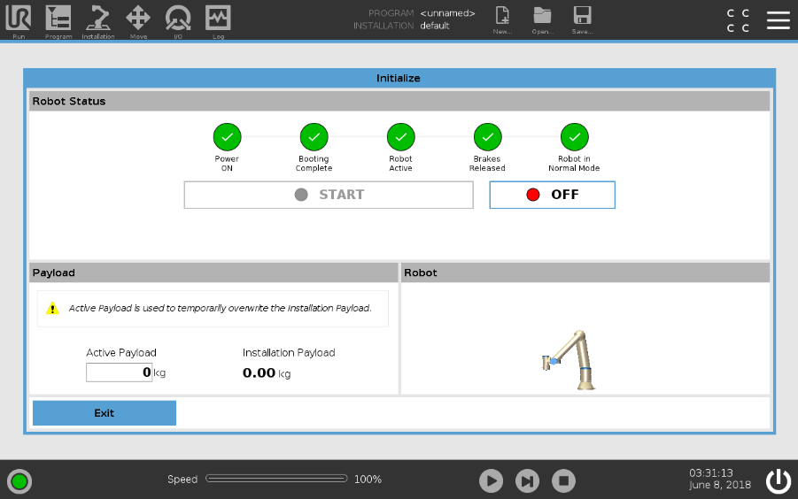

# ur5e-docker
Building docker images for UR5e

# Prerequisites

If your Panther robot is configured with UR5e robot according to Husarion's standards, all you need is to connect to the `Panther_<serial_number>` Wi-Fi network (password: `husarion`) and check if the manipulator is enabled. 

```bash
sudo apt-get install xtightvncviewer

xtightvncviewer 10.15.20.4
```

Expectations:



**Make sure the robot is in remote control mode. This mode can be changed in the upper right corner.**

# Real Hardware Demo

This demo allows the Panther robot to work with the UR5e manipulator and the Velodyne Puck LiDAR. 

Connect to the `Panther_<serial_number>` Wi-Fi network (password: `husarion`) and use these commands:

```bash
ssh husarion@10.15.20.3 # Intel NUC IP

git clone https://github.com/husarion/ur5e-docker.git

cd ur5e-docker/demo

source ./setup_virtual_desktop.sh

docker compose \
    -f compose.ur5e.yaml \
    -f compose.velodyne.yaml \
    -f compose.vnc.yaml \
    -f compose.rviz.yaml \
    up
```

After a successful launch, open the Web browser and go to [10.15.20.3:8080/vnc_auto.html](http://10.15.20.3:8080/vnc_auto.html). Enter a password (default `husarion`) and you should see RViz and Panther with the manipulator.

Use RViz MoveIt! plugin to control the UR5e robot.

# Gazebo Simulation

You can run Gazebo simulation using these commands:

```bash
git clone https://github.com/husarion/ur5e-docker.git
cd ur5e-docker/demo

xhost local:root
docker compose -f compose.ur5e-gazebo.yaml up
```

Use RViz MoveIt! plugin to control the UR5e robot.

If you have enough computing power, you can add `PointCloud` from LiDAR in Rviz (`Add->By Topic->PointCloud`).

# Custom Configuration

If your Panther is equipped with other devices/sensors you can change the .urdf file (`./ur5e_moveit_config/urdf/panther_ur5e.urdf.xacro`) and update the `ur5e_moveit_config` package using MoveIt Manager:

```bash
cd ./ur5e-docker/demo

xhost local:docker
docker compose -f compose.moveit-menager.yaml up
```
